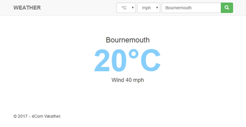

# Weather Test

Application to show my abilities as a .Net developer to [4Com](https://github.com/4Com/WeatherTest).

## Web Application

The web application displays average temperature and wind speed from the result of a query to weather APIs for a location.

The application was creted using the ASP.NET Core Web Application template in Visual Studio 2017. Default authentication was used when the project was created.

The [layout](src/WeatherTest.WebApp/Views/Shared/_Layout.cshtml) from the application template was modified to have a selector for both the temperature and wind speed within the navigation section of the application. An input box with a search button was included in the navigation section as well.

The weather for Bournemouth with the temperature in &deg;C wind speed in mph is initially displayed when lauching the application. Subsequent queries are done via a full page post back.

### Supported Unit of Measurement

A UnitOfMeasure section has been added into the [appsettings.json](src/WeatherTest.WebApp/appsettings.json) to allow for easily adding more unit of measure in the future, as well.

### Weather APIs

A WeatherProviders section has been added into the [appsettings.json](src/WeatherTest.WebApp/appsettings.json) to allow for easily adding more APIs in the future.

### Weather Checker Service

CheckAsync method of the [weather checker service](src/WeatherTest.WebApp/Services/IWeatherChecker.cs) is called by the [Index action of the HomeController](src/WeatherTest.WebApp/Controllers/HomeController.cs) during startup or when a request for the weather for the supplied location. The method queries all available weather APIs and process individual responses as they arrive.

During processing of a response, both the temperature and wind speed figures are converted into the base unit values if the response in not on the base unit already. The base unit values are then stored on a property on the response for further process later, after receiving all the responses.
